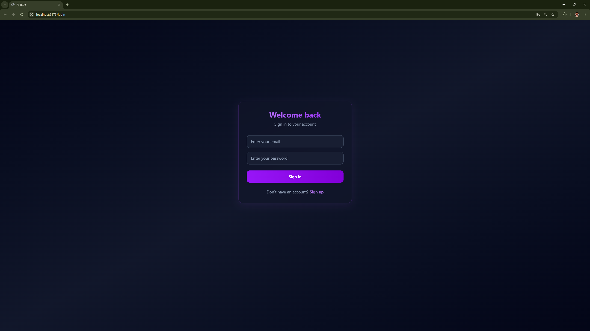
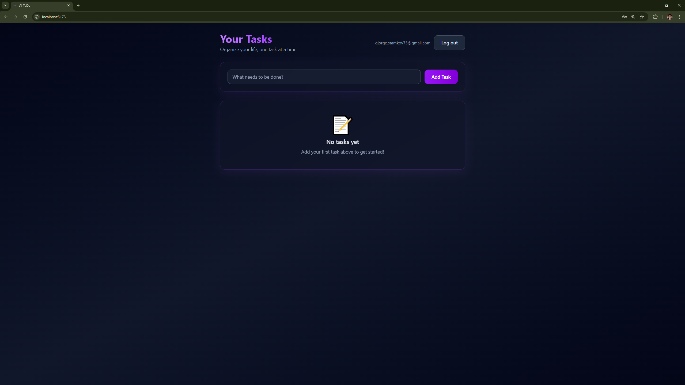
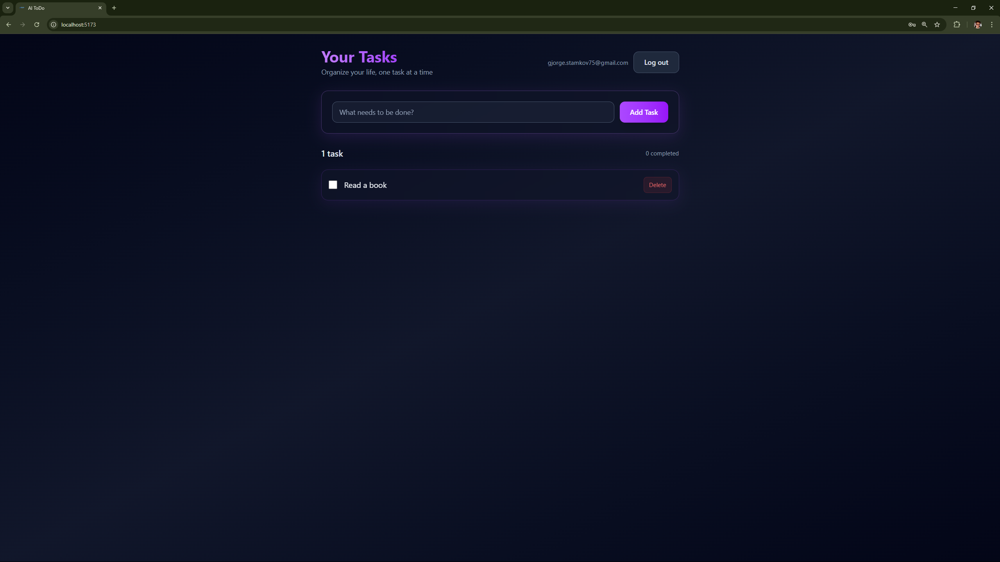
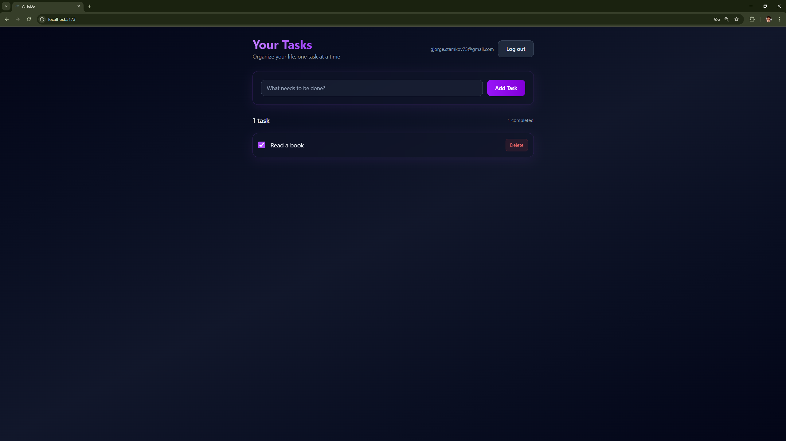
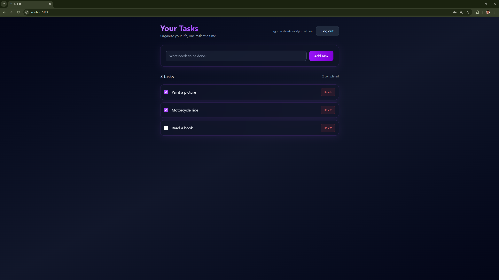

# Todo Application

This is a full‑stack AI‑powered Todo app built with Cursor using React + Vite, Node.js + Express, and MongoDB.
The project includes user authentication, task management, and a clean dark‑mode UI with purple accents, fully responsive on both desktop and mobile devices.

---

## 🚀 Features

- **User Authentication:** Register and log in users with JWT tokens stored in httpOnly cookies.
- **Task Management:** Create, list, update, and delete todos with a RESTful API.
- **Protected Routes:** Only authenticated users can access the /api/todos endpoints.
- **Responsive UI:** Modern dark‑mode design with purple accents, optimized for both desktop and mobile.
- **Cookie‑Based Auth:** Secure authentication flow using httpOnly cookies and withCredentials from the frontend.

---

## 🛠️ Tech Stack

- **Frontend:** React.js, Vite, Axios, React Router
- **Backend:** Node.js, Express.js
- **Database:** MongoDB (Mongoose)
- **Authentication:** JWT, httpOnly cookies

---

## 📦 Project Structure

- **to_do-app/
- **├── frontend/  
- **├── backend/
- **├── screenShots/  
- **└── .gitignore 
  
---

## ⚙️ Installation & Setup

1. **Clone the repository:**
   
   ```
   git clone https://github.com/your-username/todo-app.git
   cd todo-app
   ```
   
2. **Set up environment variables:**
- Create a `.env` file inside `backend/` with the following:
  ```
  MONGO_URI=mongodb://127.0.0.1:27017/todo_app
  JWT_SECRET=supersecretchangeme
  COOKIE_NAME=auth_token
  CLIENT_ORIGIN=http://localhost:5173
  PORT=4000
  ```
   
3. **Install dependencies and run servers:**
- Backend:
  ```
  cd backend
  npm install
  npm run dev
  ```
  
- Frontend:
  ```
  cd ../frontend
  npm install
  npm run dev
  ```
  
- **Backend runs on http://localhost:4000 (API: http://localhost:4000/api).
- **Frontend runs on http://localhost:5173.

---

## 📋 Usage

- **Open the app at http://localhost:5173.
- **Register or log in using the auth forms.
- **Once logged in, create, edit, and delete todos from the task list.
- **The backend protects all todo routes; unauthenticated users will be blocked.

---

## 📸 Screenshots

### Login / Register


### Todo List (Dark Mode)


### Task Creation


### Completed Task


### Multiple Task Creation


---

## 🙏 Acknowledgements

- [MongoDB](https://www.mongodb.com/) for local and cloud database hosting.
- [Vite](https://vite.dev/) for fast React development.
- [Express.js](https://expressjs.com/) for the backend API.

---

> **Created and maintained by [Gjorgi Stamkov](https://github.com/gjorgistamkov).**

   
